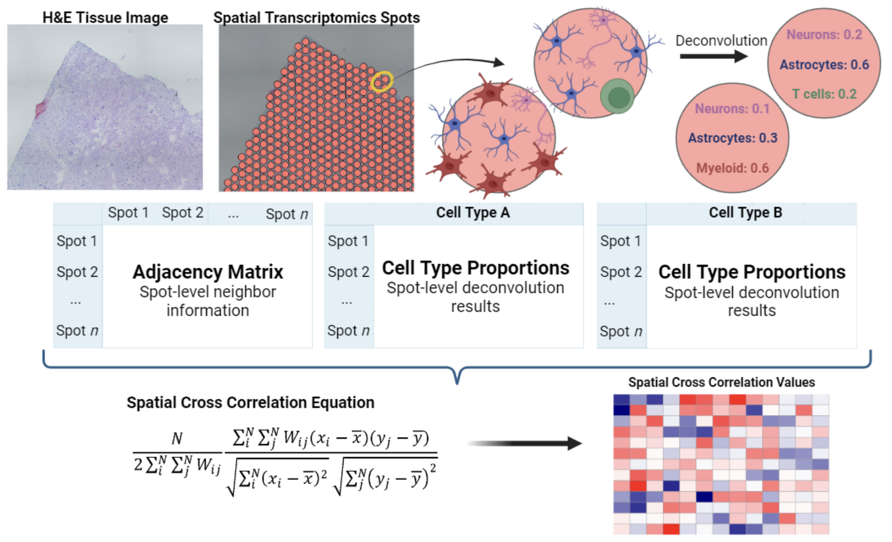

# T-cell_and_glial_pathology_in_PD


Code and data for:  
**“The spatial landscape of glial pathology and adaptive immune response in Parkinson's Disease”**

---

## Overview

This repository contains code, processed data, and analysis pipelines for spatial cross-correlation analysis of cellular interactions in Parkinson’s disease tissue.

- CPU-compatible implementation (GPU version available below)
- Modular spatial cross-correlation (SCC) framework
- Reproducible workflows aligned with ASAP Open Science requirements

**GPU version:**  
https://github.com/dalhoomist/T-cell_and_glial_pathology_in_PD/tree/scc_gpu

---

## Data Availability

Processed data:

- <https://doi.org/10.5281/zenodo.19454949>

High-resolution spatial transcriptomics images:

- <https://doi.org/10.5281/zenodo.19453569>


Supplementary data:

- <https://doi.org/10.5281/zenodo.19457731>

**Code archive (Zenodo DOI):**  
https://doi.org/10.5281/zenodo.18867341  

**Protocols (protocols.io DOI):**  
https://dx.doi.org/10.17504/protocols.io.n92ld463nl5b/v1  

---

## Experimental Protocols

### Nuclei Extraction

Nuclei were extracted from OCT-embedded brain blocks or liquid nitrogen vapor–frozen GBM tissue using the following protocol:

> Al-Dalahmah O. (2026)  
> *Nuclei Extraction from OCT-Embedded Brain Blocks or Liquid Nitrogen Vapor-Frozen GBM Brain Tissue*  
> protocols.io  
> DOI: https://dx.doi.org/10.17504/protocols.io.n92ld463nl5b/v1  

This protocol includes:
- Tissue preparation and handling  
- Nuclei isolation workflow  
- Buffer compositions  
- Quality control steps  

This protocol corresponds directly to the experimental procedures described in the manuscript Methods.

---
# Spatial Cross-Correlation Module

Python implementation for spatial cross-correlation (SCC) analysis.



---

## Installation

```bash
git clone https://github.com/dalhoomist/T-cell_and_glial_pathology_in_PD.git
```

## Set up Environment
Requirement
```bash
OS: Ubuntu Linux
Python: 3.7
Numpy: 1.21.5
Pandas: 1.3.5
```

You can build the environment with Anaconda(or miniconda):
```bash
conda create -n scc python==3.7
conda activate scc
cd T-cell_and_glial_pathology_in_PD
pip install -r requirements.txt
```

## Usage - sample data
- This module, in case of interruption and resumption, skips the already computed part and proceeds with the remaining.
- As the sample outputs are already stored in the sample_data folder, executing a command for sample data will cause the program to terminate immediately upon initiation.
- To observe the normal operation, delete some output from the path ['sample_data/out/1'] and rerun it.
```bash
python scc.py --input sample_data/ --output sample_data/out/ --order 1 --n 10
```
Parameter
```bash
--input   Directory containing enrichment and adjacency matrices  
--output  Output directory  
--order   Order of adjacency matrices  
--n       Number of parallel processes  
```
* By default, this module tries to utilize all available CPU cores for parallel execution of processes for efficient utilization.

* Due to current technical limitations, the number of parallel processes is limited to the number of rows in the Enrichment matrices(`nrow`). Even if you input a number exceeding `nrow`, the command will be executed with  [--n] set to `nrow`

## Data Format - input
- Please ensure that the order of barcode names matches for both matrices.
- Datasets are expected to be prepared in a `csv` format.
- Adjacency matrices for input should be

|  | AGTGTGGTCTATTGTG-1 | GCTATCGCGGCGCAAC-1 |  ... |Barcode n|
| :----:| :----: | :----: |  :----: | :----: | 
|AGTGTGGTCTATTGTG-1|0|1|...|0|  
|GCTATCGCGGCGCAAC-1|0|0|...|1|
|...|...|...|...|...|
|Barcode n|0|0|...|0|

- Enrichment matrices for input should be

|  | AGTGTGGTCTATTGTG-1 | GCTATCGCGGCGCAAC-1 |  ... |Barcode n|
| :----:| :----: | :----: |  :----: | :----: | 
|Type_A|0.01306|0.00010|...|0.00022|  
|Type_B|0.33542|0.48310|...|0.07694|
|...|...|...|...|...|
|Type_n|0.05631|0.06172|...|0.04630|

## Data Format - output

| combo_name | local_scc | global_scc | permutation | p_val |
| :----:| :----: | :----: |  :----: | :----: | 
|Type_A_x_Type_A|[-0.0927,...]|-0.0166|[-0.0197,...]|0.27|  
|Type_A_x_Type_B|[0.4968,...]|0.0369|[0.0127,..]|0.04|
|...|...|...|...|...|
|Type_Z_x_Type_Z|[-0.0661,...]|0.0075|0.0072,...]|0.37|

```bash
[combo_name]  # The pairing of two elements' names.
[local_scc]   # Local measurement of spatial cross-correlation.
[global_scc]  # Global measurement of spatial cross-correlation.
[permutation] # The outcome of conducting the permutation test one hundred times.
[p_val]       # P-value test.
```

## Data Directory - input
- Each sample should have matching names for both the enrichment matrices and adjacency matrices.
- You can set the path for the input folder, but ensure that all enrichment matrices are located within the 'enrich' folder.
- The folder containing adjacency matrices should follow the format 'adj_1', 'adj_3', etc., where the latter number indicates the order.

```bash
sample_data/
	├── enrich
    		├── Sample_A.csv
    		├── Sample_B.csv
    		└── ...
	├── adj_1
    		├── Sample_A.csv
    		├── Sample_B.csv
    		└── ...
	├── adj_2
    		├── Sample_A.csv
    		├── Sample_B.csv
    		└── ...
	└── out
```
## Data Directory - output

- Each sample's folder contains distributed computation outputs, which will eventually be concatenated and saved in the designated output path.
- In the output path, the module will automatically generate a folder named according to [--order].
```bash

  sample_data/out/
	        ├── 1 
	            ├── Sample_A_1
	                ├── Sample_A_1_0.csv
	                ├── Sample_A_1_1.csv
	                ├── Sample_A_1_2.csv
	                └── ...
		    ├── Sample_B_1
	    		├── Sample_B_1_0.csv
	    		├── Sample_B_1_1.csv
	                ├── Sample_B_1_2.csv
	    		└── ...
	            ├── Sample_C_1
	    		├── Sample_C_1_0.csv
	    		├── Sample_C_1_1.csv
	                ├── Sample_C_1_2.csv
	    		└── ...
		    ├── Sample_A_1.csv --> (final output for Sample_A, order=1)
	            ├── Sample_B_1.csv --> (final output for Sample_B, order=1)
	            └── Sample_C_1.csv --> (final output for Sample_C, order=1)
	        ├── 2
  		    ├── ...
		    └── ...
```

## Key Resources Table — Lab Materials

Source for this section: Nature Portfolio reporting summary. The study reports use of antibodies, mouse astrocytes, and 293T cells, with vendor and catalog information listed below.

| Resource Type | Resource | Source | Catalog / Identifier | RRID | Additional Information |
|---|---|---|---|---|---|
| Protocol | Nuclei Extraction from OCT-Embedded Brain Blocks or Liquid Nitrogen Vapor-Frozen GBM Brain Tissue | protocols.io | https://dx.doi.org/10.17504/protocols.io.n92ld463nl5b/v1 | N/A | Recipe-style protocol with persistent DOI; corresponds to Methods |
| Antibody | MT3, rabbit | Millipore | HPA004011 | no RRID found | Primary antibody listed in reporting summary |
| Antibody | GFAP, chicken | Abcam | ab4674 | RRID:AB_304558 | Primary antibody |
| Antibody | ALDH1L1, mouse | EnCor Biotechnology | MCA-2E7 | RRID:AB_2572220 | Primary antibody |
| Antibody | CD68, mouse | Dako | ab783 | no RRID found | Primary antibody |
| Antibody | CD69, rabbit | Booster | A00529-2 | no RRID found | Primary antibody |
| Antibody | PD1, mouse (clone NAT105) | Cell Marque | 315M-98 | no RRID found | Primary antibody |
| Antibody | CD103, rabbit | Abcam | ab129202 | RRID:AB_11142856 | Primary antibody |
| Antibody | CD44, mouse | Millipore | SAB1405590 | no RRID found | Primary antibody |
| Antibody | CD3, rabbit | Sigma | 103R-94 | no RRID found | Primary antibody |
| Antibody | CD8, mouse, prediluted, clone 4B11 | Leica | CD8-4B11-L-CE | RRID:AB_10555292 | Primary antibody |
| Antibody | NeuN, mouse | Millipore | MAB377 | RRID:AB_2298772 | Primary antibody |
| Secondary antibody | Anti-Mouse Alexa Fluor 488 donkey | Invitrogen | A32766 | RRID:AB_2762823 | Secondary antibody |
| Secondary antibody | Anti-Rabbit Alexa Fluor 568 donkey | Invitrogen | A10042 | RRID:AB_2534017 | Secondary antibody |
| Secondary antibody | Anti-Chicken Alexa Fluor 488 donkey | Jackson ImmunoResearch | 703-545-155 | RRID:AB_2340375 | Secondary antibody |
| Primary cells | Mouse astrocytes | ScienCell | 1800-57 | no RRID found | Cultured in astrocyte medium on poly-L-lysine plates |
| Cell line | HEK293T (293T) | ATCC | CRL-3216 | RRID:CVCL_0063 | Maintained in DMEM + 10% FBS + 1% Pen/Strep |
| Cell culture medium | Astrocyte culture medium | ScienCell | 1801 | no RRID exists | Used for astrocyte culture |
| Cell culture reagent | Fetal bovine serum | Gemini Bio | 900-108-500 | no RRID exists | Used for 293T culture |
| Cell culture reagent | Penicillin-Streptomycin | Thermo Fisher Scientific | 15070063 | no RRID exists | Used for 293T culture |

All antibodies were commercially available and validated by the manufacturers. The cell lines were validated by the manufacturer, astrocytes were authenticated using RNA-seq, and no mycoplasma contamination was detected.

## Key Resources Table — Software & Algorithms

Environment definition: `environment.yml` (conda env name: `scc`; channels: `pytorch`, `anaconda`, `defaults`).

| Software / Algorithm | Source (stable URL) | Version | RRID (if available) |
|---|---|---:|---|
| Python | [python.org](https://www.python.org) | 3.7.16 | N/A |
| NVIDIA CUDA Toolkit (`cudatoolkit`) | [developer.nvidia.com/cuda-toolkit](https://developer.nvidia.com/cuda-toolkit) | 11.3.1 | N/A |
| PyTorch | [pytorch.org](https://pytorch.org) | 1.13.0 | N/A |
| TorchVision | [pytorch.org/vision](https://pytorch.org/vision) | 0.14.0 | N/A |
| TorchAudio | [pytorch.org/audio](https://pytorch.org/audio) | 0.13.0 | N/A |
| CuPy (CUDA 11.2 build) | [cupy.dev](https://cupy.dev) | cupy-cuda112 10.6.0 | N/A |
| Jupyter | [jupyter.org](https://jupyter.org) | 1.0.0 | N/A |
| Jupyter Notebook | [jupyter.org](https://jupyter.org) | 6.5.5 | N/A |
| NumPy | [numpy.org](https://numpy.org) | 1.21.5 | N/A |
| SciPy | [scipy.org](https://scipy.org) | 1.7.3 | N/A |
| pandas | [pandas.pydata.org](https://pandas.pydata.org) | 1.3.5 | N/A |
| scikit-learn | [scikit-learn.org](https://scikit-learn.org) | 1.0.2 | N/A |
| Matplotlib | [matplotlib.org](https://matplotlib.org) | 3.5.3 | N/A |
| seaborn | [seaborn.pydata.org](https://seaborn.pydata.org) | 0.12.2 | N/A |
| scikit-image | [scikit-image.org](https://scikit-image.org) | 0.19.3 | N/A |
| OpenCV (Python) | [opencv.org](https://opencv.org) | opencv-python 4.9.0.80 | N/A |
| OpenSlide (Python) | [openslide.org](https://openslide.org) | openslide-python 1.2.0 | N/A |
| AnnData | [anndata.readthedocs.io](https://anndata.readthedocs.io) | 0.8.0 | N/A |
| h5py | [h5py.org](https://www.h5py.org) | 3.8.0 | N/A |
| PyTables | [pytables.org](https://www.pytables.org) | 3.7.0 | N/A |
| Pillow | [python-pillow.org](https://python-pillow.org) | 9.5.0 | N/A |
| imageio | [imageio.readthedocs.io](https://imageio.readthedocs.io) | 2.31.2 | N/A |
| TensorBoard | [tensorflow.org/tensorboard](https://www.tensorflow.org/tensorboard) | 2.11.2 | N/A |
| Pyro (pyro-ppl) | [pyro.ai](https://pyro.ai) | 1.8.6 | N/A |


The data, code, protocols, software, and key lab materials used in this study are listed in the Key Resources Tables below, together with stable source information, catalog identifiers, and RRIDs where available.
**Zenodo (code archive DOI):** https://doi.org/10.5281/zenodo.18867341.

## References
- Chen Y. A New Methodology of Spatial Cross-Correlation Analysis. PLoS ONE 10(5): e0126158. (2015) [doi:10.1371/journal.pone.0126158](https://doi.org/10.1371/journal.pone.0126158)
- Jakubiak K. et al. The spatial landscape of glial pathology and T-cell response in Parkinson’s disease substantia nigra. bioRxiv 2024.01.08.574736; (2024) doi: https://doi.org/10.1101/2024.01.08.574736
- Al-Dalahmah, O. et al. Re-convolving the compositional landscape of primary and recurrent glioblastoma reveals prognostic and targetable tissue states. Nat Commun 14, 2586 (2023). https://doi.org/10.1038/s41467-023-38186-1
